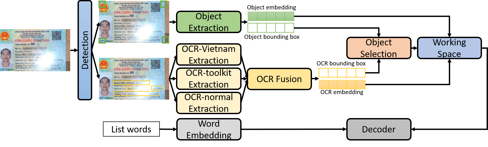

# M-ID Architecture


M-ID features an end-to-end pipeline designed for robust and accurate information extraction from Vietnamese Citizen ID Card images.

## Key Features
- Auto-detect and classify old/new CCCD
- Crop the ID card region from input images
- Extract text fields of the ID card.
- Simple, user-friendly web UI

## Installation

1. Clone the repository:
```bash
git clone https://github.com/ntanhhh/M-ID.git
cd M-ID
```

2. Install dependencies:
```bash
pip install -r requirements.txt
```

3. Download required models from [Google Drive](https://drive.google.com/drive/folders/14t1fJQrsg2noPLxsUB854mmRwEP9vU6d?usp=sharing) and place them under `model/` as follows:
```
model/
├── vgg_transformer.pth
├── detect_ttin/
│   ├── cccd_cu.pt
│   └── cccd_moi.pt
├── detect_4goc/
│   └── best.pt
└── finetune_vietocr/
    ├── config.yml
    └── transformerocr.pth


```

## Project Structure
```
CCCD_Extractor/
├── main.py            # FastAPI server
├── m_ocr.py           # Multi-engine OCR pipeline
├── cropper.py         # CCCD region cropping
├── requirements.txt   # Python dependencies
├── README.md          # This document
├── model/             # Model files
├── cropped_images/    # Cropped CCCD images
├── temp_uploads/      # Temporary uploads
├── templates/         # Web UI (index.html)
├── dataset/           # (Optional) Training data
├── results/           # (Optional) Outputs, logs
```

## Usage

1. Run the server:
```bash
uvicorn main:app --reload
```

2. Open the web UI:
- Visit http://localhost:8000
- Upload a CCCD image; the system will crop and extract information automatically

3. API endpoints:
- `POST /upload`   – Upload a CCCD image
- `POST /crop`     – Crop the CCCD region
- `POST /extract`  – Extract fields from a cropped CCCD image

## Model Requirements
- Old CCCD detection: `model/detect_ttin/cccd_cu.pt`
- New CCCD detection: `model/detect_ttin/cccd_moi.pt`
- CCCD cropping: `model/detect_4goc/best.pt`
- OCR: `model/finetune_vietocr/transformerocr.pth` and `model/finetune_vietocr/config.yml`
- VGG Transformer OCR weights: `model/vgg_transformer.pth`

## Notes
- Prepare `cropped_images/` and `temp_uploads/` before running, or they will be created automatically.
- Ensure all required model files exist under `model/`.

## License

MIT License